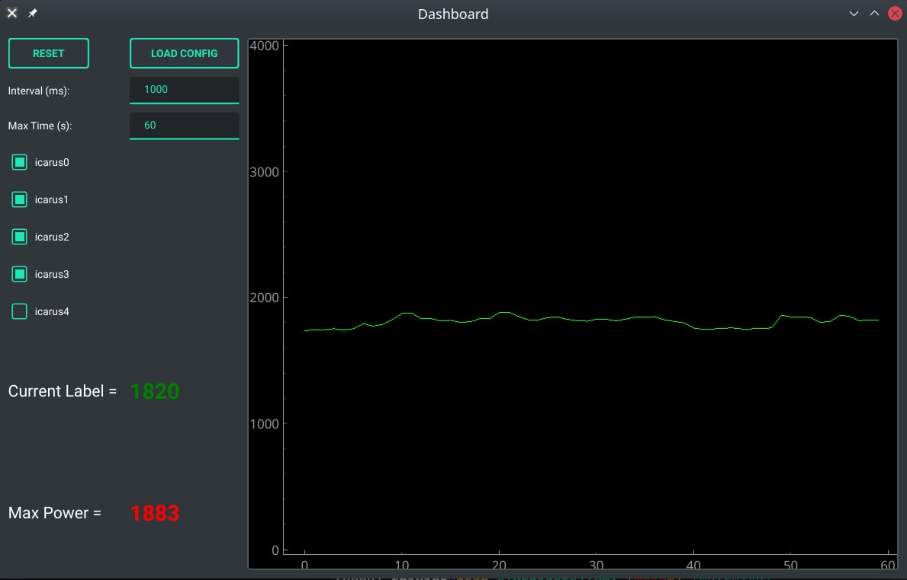

# Monitor of Servers

## Usage
```bash
git clone https://github.com/xwy-bit/IPMI.git
cd IPMI
# change your ip,user,passwd in `gui.py`
python gui.py # in your envorinment that has packages above
```
## API 
`Ipmi.py` supports some common APIs

### Initalization
```python
# for example
from Ipmi import ipmi
i0 = ipmi('ip','user','passwd') # create an object for the server
i0.establish() # post info to login
```
### APIs' usage
- `return` total power of server (unit:Watt)
```python
i0.get_power() 
```
- `return` fans' info
```python
i0.get_fans(get_type = )
    # + get_type = 'power'(default) ,it will `return` total power of fans
    # + get_type = 'pwm' ,it will `return` a list includes every pwm value 
    #     ,like [75,75,75,75,75,75,75,75] 
```
- `control` fans
```python
i0.control_fans(mode = ,pwd = )
    # + mode = 'auto'(default),it will set mode to auto
    # + mode = 'manual',it will change mode to manul
    # ++ pwd = 75, set pwd value to 75 while mode = 'manual'
    #     i0.control_fans(mode = 'manual',pwd = 75)
```
### close session
```python
i0.close()
    # remember to close the session
```
## Overview

