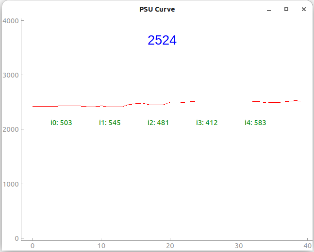

  
# Monitor of Servers
## requirements
- pyQt5
- pyqtgraph
- requests
## Usage
```bash
git clone https://github.com/xwy-bit/IPMI.git
cd IPMI
python gui.py # in your envorinment that has packages above
```
## Overview

